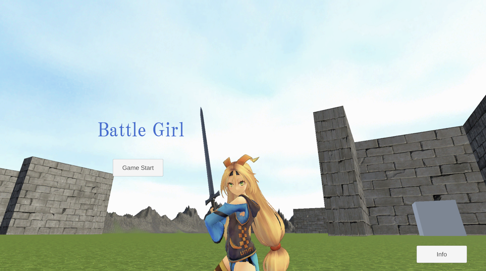
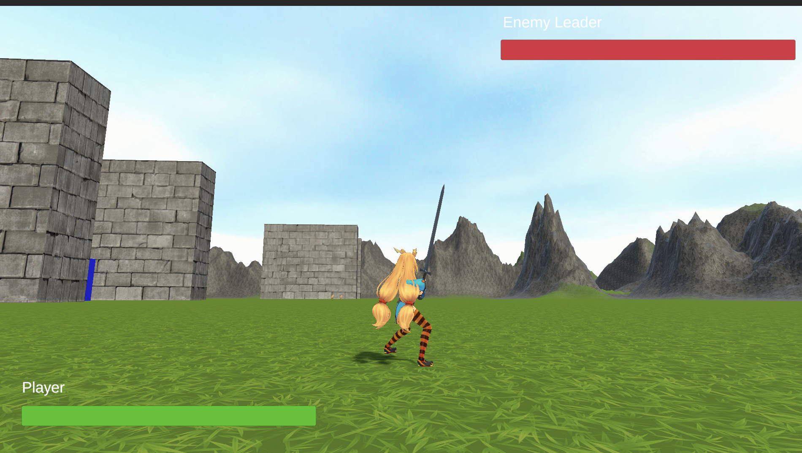
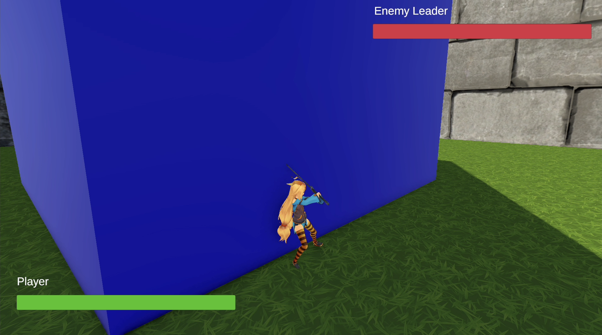
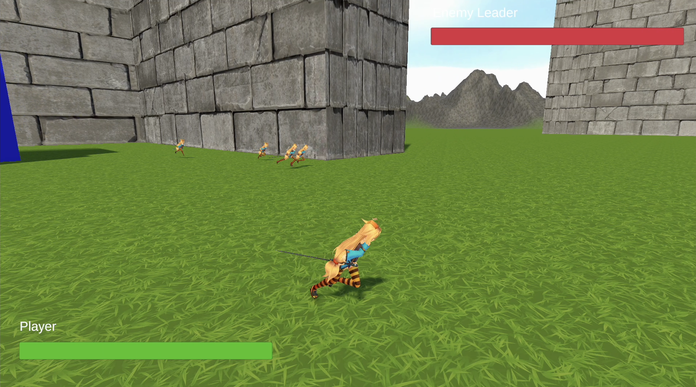
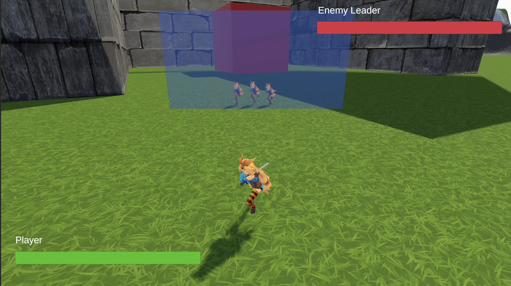
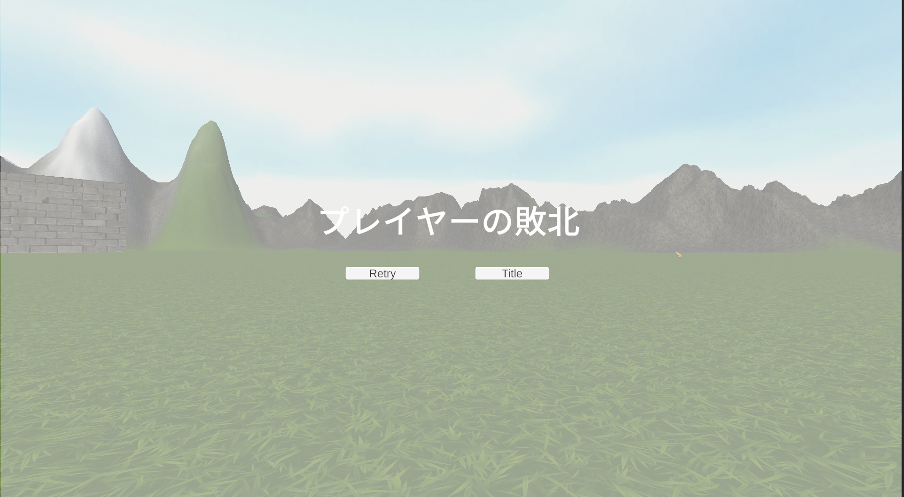
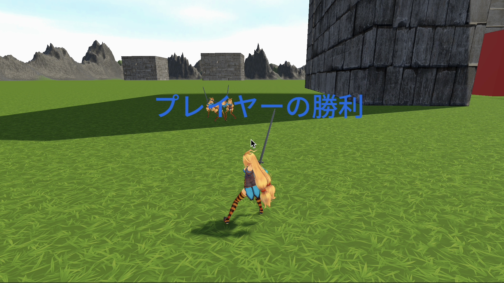

# Unity Girl(個人制作)
## 概要
プレイヤーキャラのUnityちゃんを動かして拠点を制圧したり、取り返したりして敵リーダーを倒すことを目指すゲームです。<br>

* 制作人数:1人
* 制作期間:1ヶ月
* 使用エンジン：Unity Editorバージョン 6000.0.54f1
* シーンレンダー：Universal 3D 
* 使用言語：C#
* 使用アセット：UnityアセットストアとUnityちゃん公式ページのものを使用<br>
unity-chan! :敵、味方、プレイヤーキャラ<br>
TileableBricksWall:拠点の壁の模様<br>
Procedural Terrain Painter:地形を生成するテライン用の素材<br>
Fantasy Skybox FREE:空用の素材<br>
RPG Character Mecanim Animation Pack FREE:キャラクターのモーション用のアニメーション<br>
Melee Weapons Pack [Swords - Axes]:武器に使用<br>
* Fontデータ： Noto Sans JP-Medium SDF (TMP_Font Asset)
* 使用ツール:GitHub、SorceTree、VisualStudioCode、Chrome、Safari、Chatgpt、Google AI Studio、 Google Gemini、Macbook

## サンプルゲーム
https://rune337.github.io/WebUnityGirl/

## ゲームフロー
* タイトル<br>
GameStart:ゲームをスタートできます。<br>
Info:BGM、SEの引用元を記載しています。


* ゲームシーン<br>
<br>
<br>
<br>
<br><br><br>

* 敗北画面
タイトルに戻るか再プレイするか選びます。
<br><br><br>

* 勝利画面
3秒でタイトルに戻ります。
<br><br><br>

## ゲームルール
プレイ環境:PCのブラウザ<br>
勝利条件:敵リーダの撃破<br>
敗北条件:プレイヤーの敗北<br><br>
拠点を制圧すると味方が生成されます。<br>
敵に拠点を制圧されると敵が増えます。<br>
拠点を取り返すことが可能です。<br>
拠点を攻撃して拠点のHPを0にすると拠点の色が変わります。<br>
拠点の色は青なら味方拠点、赤なら敵拠点になります。<br>
誰も制圧していない拠点は白色です。<br>
白色の拠点は拠点に入るだけで自分の拠点になります。<br>
拠点の数だけ味方は復活できます<br>
リーダーは復活できません。<br><br>

## 操作方法
十字キー:移動<br>
スペースキー:ジャンプ<br>
Pキーまたは左クリック:攻撃、押しっぱなしまたは3秒以内に再度押すと連続攻撃<br>
Oキー:正面に壁展開(2秒で消える)<br>
Lキー:味方集合フラグONになり味方が集合、Player横の青いアイコン点灯でON<br>

## プログラム
### スクリプト構成
キャラクター<br>
PlayerController.cs:プレイヤーの操作<br>
AllyController.cs:味方NPCを自動操作<br>
EnemyController.cs:敵NPCを自動操作<br>
EnemyLeaderController.cs:敵リーダーを自動操作<br><br>

拠点<br>
BaseCore.cs:拠点コア自身のダメージ判定<br>
aseRange.cs:拠点への侵入判別、拠点のタグ変更、拠点コアの色変更<br>
ChangeColor.cs拠点コアの色変更<br><br>

UI<br>
UiController.cs:バトル中のUI管理<br>
TitleUiController.cs:タイトル中のUI管理<br><br>

管理<br>
SoundManger.cs:BGM、SE管理<br>
GameManager.cs:ゲームステータス管理、拠点のリスト管理、NPC生成管理<br>
ChangeScene.cs:シーン変更管理<br><br>

その他<br>
ShieldController.cs:プレイヤーの正面に壁展開<br>
SwordCollider.cs:剣のコライダーオンオフ<br>
SwordAttack.cs:プレイヤーの攻撃コンボ<br>
CameraController.cs:カメラ操作<br><br>


## プログラム例
### 攻撃コンボ
前回の攻撃から今回の攻撃までの時間が、コンボ時間を超えているかどうかで
次の攻撃モーションに行くようにしています。
```C#
void AttackCombo()
    {
        float timeSinceLastClick = Time.time - lastClickTime; //前回クリックしてからの経過時間

        //前回のクリックからの時間がコンボの猶予時間を超えている
        if (timeSinceLastClick > clickMaxDelay)
        {
            clickCount = 1; //時間を越えると新しい攻撃にする
        }
        else
        {
            clickCount++; //時間内なので攻撃増加
            if (clickCount > 5)
                clickCount = 1; //コンボ数最大4なのでそれを超えたら1にリセットする
        }
        lastClickTime = Time.time;
        animator.SetFloat("Attack", clickCount);
        swordCollider.EnableSwordCollider(); //剣のコライダーを有効にするのを呼び出す
    }
```

### NPC AI
NavMeshAgentを使用しています。<br>
以下の行動順序に従って行動します。<br><br>
味方行動順序<br>
1 プレイヤー集合フラグがONならプレイヤーについていく<br>
2 敵が範囲にいる<br>
3 敵リーダが範囲にいる<br>
4 Base Core(フリー拠点サーバー)が範囲にいる<br>
5 Enemy_Ba(敵拠点サーバー)が範囲にいる<br>
6 プレイヤーについていく<br>
7 Player_Ba(味方拠点サーバー)が範囲にいる<br><br>

それぞれの対象のオブジェクトとの距離を比較して近いオブジェクトを引数として渡して移動するメソッドを呼び出しています。<br>
ifで入り口を広くして実行されたらそれより下は実行しないようにしています。<br>

```C#
AllyController.cs
//プレイヤー集合フラグがONの時、プレイヤーについていく
        if (playerController.isUnderPlayer)
        {
            if (player != null)
            {
                float distanceToPlayer = Vector3.Distance(player.transform.position, transform.position);
                if (distanceToPlayer <= playerRange)
                {
                    Move(player, distanceToPlayer);
                    return;
                }
            }
        }


        //敵がいる時
        if (enemy.Length != 0)
        {
            enemyDistance.Clear();
            distanceEnemy = new float[enemy.Length]; //敵の距離を入れる配列の初期化

            for (int i = 0; i < enemy.Length; i++)
            {
                distanceEnemy[i] = Vector3.Distance(enemy[i].transform.position, transform.position);
                enemyDistance.Add(new EnemyDistance(enemy[i], distanceEnemy[i]));
                if (enemyDistance.Count != 0)
                {
                    closestEnemy = ClosestObject(enemyDistance);
                    closestEnemyDistance = Vector3.Distance(closestEnemy.transform.position, transform.position);

                    if (closestEnemyDistance <= detectionRange)
                    {
                        Move(closestEnemy, closestEnemyDistance);
                        return;
                    }
                }

            }
        }

        //敵リーダーがいる時
        if (enemyLeader != null)
        {
            distanceToEnemyLeader = Vector3.Distance(enemyLeader.transform.position, transform.position);
            if (distanceToEnemyLeader <= detectionRange)
            {
                Move(enemyLeader, distanceToEnemyLeader);
                return;
            }
        }

        //ベースコアがいる時
        if (GameManager.Instance.GetFoundBaseObjects().Count != 0) //nullで空ではなく0になるので
        {
            baseCoreDistanceInfo.Clear();

            for (int i = 0; i < GameManager.Instance.GetFoundBaseObjects().Count; i++)
            {
                float distance = Vector3.Distance(GameManager.Instance.GetFoundBaseObjects()[i].transform.position, transform.position);
                baseCoreDistanceInfo.Add(new BaseCoreDistanceInfo(GameManager.Instance.GetFoundBaseObjects()[i], distance));
            }

            if (baseCoreDistanceInfo.Count != 0)
            {
                closestBaseCore = ClosestObject(baseCoreDistanceInfo);
                closestBaseCoreDistance = Vector3.Distance(closestBaseCore.transform.position, transform.position);
                Debug.Log(closestBaseCore);
                // Debug.Log(closestBaseCoreDistance);
                if (closestBaseCoreDistance <= baseCoreDetectionRange)
                {
                    MoveCore(closestBaseCore, closestBaseCoreDistance);
                    return;
                }
            }
        }

        //敵ベースコアがいる時
        if (GameManager.Instance.EnemyGetFoundBaseObjects().Count != 0) //nullで空ではなく0になるので
        {
            enemyBaseCoreDistanceInfo.Clear();

            for (int i = 0; i < GameManager.Instance.EnemyGetFoundBaseObjects().Count; i++)
            {
                float distance = Vector3.Distance(GameManager.Instance.EnemyGetFoundBaseObjects()[i].transform.position, transform.position);
                enemyBaseCoreDistanceInfo.Add(new EnemyBaseCoreDistanceInfo(GameManager.Instance.EnemyGetFoundBaseObjects()[i], distance));
            }

            if (enemyBaseCoreDistanceInfo.Count != 0)
            {
                Debug.Log("敵コア");
                closestEnemyBaseCore = ClosestObject(enemyBaseCoreDistanceInfo);
                closestEnemyBaseCoreDistance = Vector3.Distance(closestEnemyBaseCore.transform.position, transform.position);
                Debug.Log(closestEnemyBaseCore);
                Debug.Log(closestEnemyBaseCoreDistance);
                if (closestEnemyBaseCoreDistance <= baseCoreDetectionRange)
                {
                    MoveCore(closestEnemyBaseCore, closestEnemyBaseCoreDistance);
                    return;
                }
            }
        }

        //プレイヤーがいる時
        if (player != null)
        {
            float distanceToPlayer = Vector3.Distance(player.transform.position, transform.position);
            if (distanceToPlayer <= playerRange)
            {
                Move(player, distanceToPlayer);
                return;
            }
        }


        //味方に近づいた時に止めないと全部拠点制圧して入ってきた味方止まるところないから
        //味方ベースコアがいる時
        if (GameManager.Instance.PlayerGetFoundBaseObjects().Count != 0)
        {
            Debug.Log("味方コア");
            playerBaseCoreDistanceInfo.Clear();

            for (int i = 0; i < GameManager.Instance.PlayerGetFoundBaseObjects().Count; i++)
            {
                float distance = Vector3.Distance(GameManager.Instance.PlayerGetFoundBaseObjects()[i].transform.position, transform.position);
                playerBaseCoreDistanceInfo.Add(new PlayerBaseCoreDistanceInfo(GameManager.Instance.PlayerGetFoundBaseObjects()[i], distance));
            }

            if (playerBaseCoreDistanceInfo.Count != 0)
            {
                closestPlayerBaseCore = ClosestObject(playerBaseCoreDistanceInfo);
                closestPlayerBaseCoreDistance = Vector3.Distance(closestPlayerBaseCore.transform.position, transform.position);
                Debug.Log(closestPlayerBaseCore);
                Debug.Log(closestPlayerBaseCoreDistance);
                if (closestPlayerBaseCoreDistance <= baseCoreDetectionRange)
                {
                    MoveCore(closestPlayerBaseCore, closestPlayerBaseCoreDistance);
                    return;
                }
            }
        }
```

### 拠点変化
拠点の範囲のコライダーの中に拠点のコアがあります。<br>
初回侵入時はコライダーに侵入した時にコアのタグを変えます。<br>
以降はHPが0になった時に現在とは別のタグになります。<br>
味方なら敵に、敵なら味方になります。<br>
```C#
BaseRange.cs
//タグを変える用のメソッド
    public void ChangeCoreTag()
    {
        //敵からプレイヤーにする
        if (this.tag == "Enemy_Ba")
        {
            this.tag = "Player_Ba";
            baseCore.tag = "Player_Ba";
            // 取得した baseCoreChangeColor インスタンスの SetColor を呼び出す
            baseCoreChangeColor.SetColor(playerColor);
            baseCoreDamageTag.DamageTag();
            StartCoroutine(DelayedActionCoroutine());
        }

        //プレイヤーから敵にする
        else if (this.tag == "Player_Ba")
        {
            this.tag = "Enemy_Ba";
            baseCore.tag = "Enemy_Ba";
            // 取得した baseCoreChangeColor インスタンスの SetColor を呼び出す
            baseCoreChangeColor.SetColor(enemyColor);
            baseCoreDamageTag.DamageTag();
            StartCoroutine(DelayedActionCoroutine());
        }
    }


```

### 拠点のダメージ判定
拠点は味方の攻撃で変化してしまわないように、
攻撃者のタグを判別してダメージを受けるようにします。
プレイヤー拠点なら攻撃者にプレイヤーのタグが含まれていなければ、
敵拠点なら攻撃者にエネミーのタグが含まれていなければダメージを受けます。
```C#
BaseCore.cs
public void DamageTag()
    {
        //現在のcoreのタグを元に攻撃者のタグに含まれる文字を検索する文字を決定する
        if (this.tag == "Player_Ba")
        {
            target = "Player";
        }
        else if (this.tag == "Enemy_Ba")
        {
            target = "Enemy";
        }
        else if (this.tag == "Base")
        {
            target = "Base";
        }
    }

BaseCore.cs
     void OnTriggerEnter(Collider other)
    {
        if (isInvincible) //無敵状態なら何もしない
            return;

        // Debug.Log(other.transform.root.tag);

        //攻撃者のタグに自分のタグに含む文字と同じ文字が含まれていない時=陣営同じじゃない時
        //other.transform.parent.tagだと直近の親とってくるだけなので一番上の親とりたい時はrootにする
        if (!other.transform.root.tag.Contains(target))
        {

            //剣に当たった時ダメージ処理
            if (other.gameObject.CompareTag("EnemySword") || other.gameObject.CompareTag("PlayerSword"))
            {
                isInvincible = true; //ダメージを受けたら無敵
                coreHP--;
                Debug.Log("コアのHP " + coreHP);
                Debug.Log(target);

                StartCoroutine(SetInvincibilityTimer());
            }
        }
    }


```

### 一番近い拠点の判別
GameManagerから受け取ったリストからオブジェクトとの距離を計算して距離とオブジェクトをセットにしたインスタンスを作って、リストにセットの値として追加します。<br>
一番近い距離を比較するメソッドでリストの要素を比較して一番近い拠点を戻り値として返します。<br>
```C#
AllyController.cs
    //ベースコアと距離を結びつけるクラス
    public class BaseCoreDistanceInfo
    {
        public GameObject baseCoreObject;
        public float baseCoreDistance;

        //コンストラクタ
        public BaseCoreDistanceInfo(GameObject obj, float dist)
        {
            baseCoreObject = obj;
            baseCoreDistance = dist;
        }
    }


    //ベースコア距離クラスを使ってベースコアの距離リスト定義
    private List<BaseCoreDistanceInfo> baseCoreDistanceInfo = new List<BaseCoreDistanceInfo>();

    //一番近い距離を比較するメソッド
     public GameObject ClosestObject(List<BaseCoreDistanceInfo> baseCoreDistanceInfo)
    {
        Debug.Log("ベースコアのオーバーロード");
        if (baseCoreDistanceInfo.Count == 0)
        {
            return null;
        }
        //リストの最初の要素を最も近い値として定義
        BaseCoreDistanceInfo firstInfo = baseCoreDistanceInfo[0];

        // 2番目の要素から最後までループして比較
        for (int i = 1; i < baseCoreDistanceInfo.Count; i++)
        {
            if (baseCoreDistanceInfo[i].baseCoreDistance < firstInfo.baseCoreDistance)
            {
                // より近いものが見つかったら更新
                firstInfo = baseCoreDistanceInfo[i];
            }
        }
        return firstInfo.baseCoreObject;
    }
```


### 剣のダメージ判定
常に剣にコライダーをつけていると、攻撃していない時もダメージが発生してしまうので
攻撃のアニメーションの時だけ剣につけているコライダーを有効にします。<br>
```C#
void Awake()
    {
        swordCollider = sword.GetComponent<Collider>();
        // swordCollider = GetComponent<Collider>(); //このスクリプトと同じGameObjectにあるコライダーを取得
        swordCollider.enabled =false; //最初はコライダーを無効にしておく
    }

    // Update is called once per frame
    public void EnableSwordCollider()
    {
        swordCollider.enabled = true;
        Debug.Log("剣のコライダーを有効にしました。");
    }
    public void DisableSwordCollider()
    {
        swordCollider.enabled = false;
        Debug.Log("剣のコライダーを無効にしました。");
    }
}
```

## 工夫
### プログラム
敵や味方の行動や自動生成でうまくいかないことが多かったです。<br>
大まかに何かif文で分けるや配列で取得したものを使うなど思いついても、それを具体的な処理にまで形にできないこともありました。<br>
ネットやAIなどで情報を検索しつつ、引っ張ってきたコードを組み込んでデバッグをしながら、処理を簡単にしてみたり分けてみたりしました。<br>

### AIの活用
大枠として配列で持ってきたいや、条件分岐させたい、値とオブジェクトをセットにしたいなどと思い浮かんだ際に、
具体的な書き方についてAIを活用しました。
AIだと複雑すぎる何をしているかわからないコードを出すこともありますので、そういうものはあまり使わず細かく処理を動かしてみて
自分でも読めるものということを意識して作成しました。


## 今後の課題
### プログラム
調べたものをデバッグしながらの作成になっており、
プログラムの細かい処理まですべて自分考えて作ったわけではないので、
次はもっと自分で細かい処理を考えながら作成したいです。<br>

### 機能
ミニマップやキャラの色分け的なところができていないので、追加したいと思っています。<br>
また、モーションを自分で作れないのでモーションなども勉強してアニメーションの幅を広げたいです。<br>
